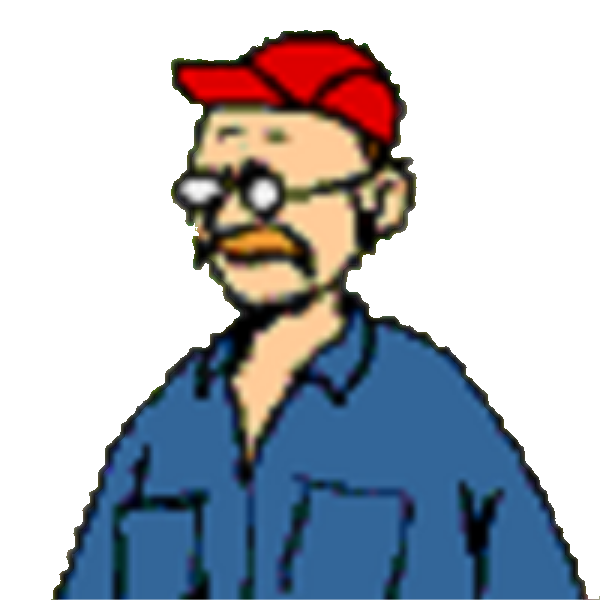
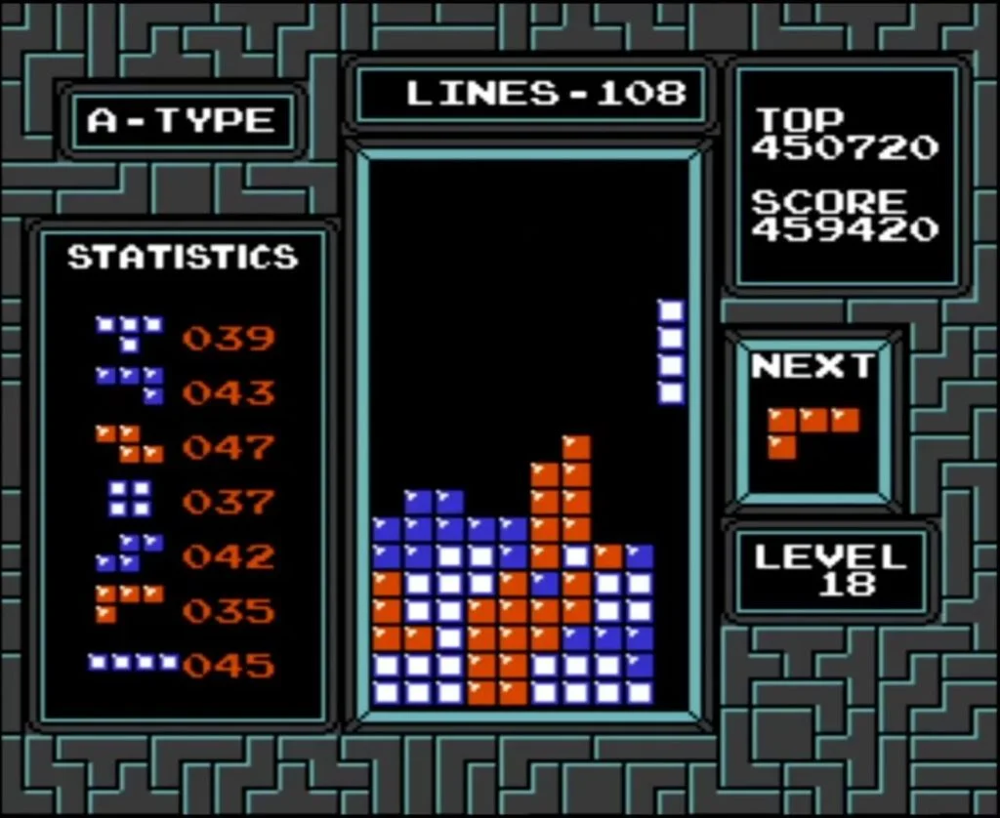
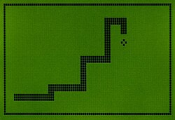
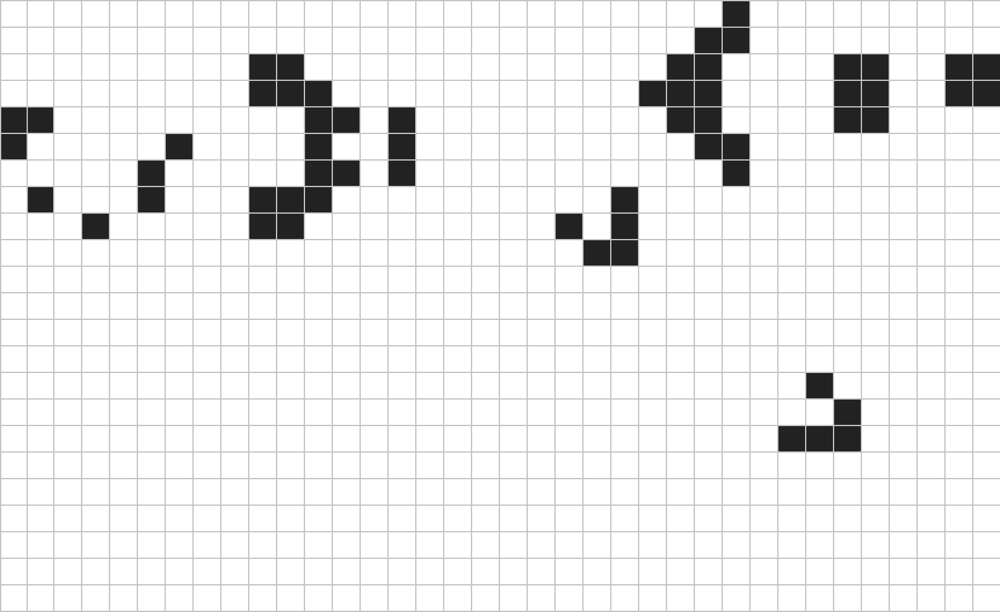
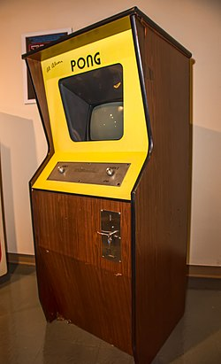
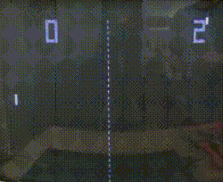

[](https://liascript.github.io/course/?https://raw.githubusercontent.com/Friedy630/Matrix_Games/refs/heads/main/Presentation.md)

# LED Box Project

<!--
1. Attention grabber
2. What will audience get out of watching/listening to you? Why should they?
3. What is the scope of your presentation (how much are you loading on to the audience)?
4. What was your inspiration? What were your initial ideas? Was there anything you tried but abandoned?
5. What background information, theory or technical details do your audience need to know to be able to understand your show/game?
6. Code (Product)
-   Big picture
-   Important code snippets
-   Bug examples
-   What did you already know (and from where do you know it) and what did you have to learn to complete the project?
7. Code (process)
-   How did you code? Vibe? GitHub?
8. The show/game. Demo and description
9. Conclusion
10. Reflection. What did we get from taking part in this challenge?
11. Final thought/take-home message
-->

## Outline

## 1. (Attention Grabber)

<!--
Talk is cheap. Show me the code - Linus Torvalds

Never trust a computer you can't throw out a window - Steve Wozniak

It doesn't (yet?) run Doom.

Picture of Oscilloscope running Pong

!?[Presentation!](https://www.youtube.com/watch?v=H7RkiOck8u4]
-->

## 2. Presentation Objectives

Show you what we programmed, how we did it, and what we learned.

    [screenshot of every game we have]
    [screenshot of the LED matrix]

## 3. Outline / Ideas

We had many ideas:

-   a Falling Sand Simulation
-   a Presentation Screen
-   3 body problem simulation
-   slither.io clone

<table style="background-color:rgb(81, 81, 71); border: 2px solid rgb(98, 98, 91); margin-left: 0; padding: 8px">
	<tr>
		<td style="white-space: nowrap; padding-left:24px; text-align: left; font-size: 1.2em; color: #ffffff; vertical-align: middle;">
			"The final idea was to program <strong>
				<span style="color: #6c63ff;">T</span>
				<span style="color: #f44336;">E</span>
				<span style="color: #ffeb3b;">T</span>
				<span style="color: #4caf50;">R</span>
				<span style="color: #2196f3;">I</span>
				<span style="color: #ff9800;">S</span>
			</strong>, <br>but that escalated <em>quickly</em>!"
		</td>
		<td style="padding-right: 8px; text-align: center;">
			
		</td>
	</tr>
</table>

## 4. Inspiration / History of Games

### Tetris

 format: ja lol ey
- Developed in 1985 by **Alexey Pajitnov** on an **Elektronika 60** (not an IBM machine)  
- Hardware:
  - 16-bit system  
  - 8 KB RAM
- One of the best-selling video games of all time  
- Considered a video game classic  
- Licensed to **Nintendo** (Game Boy, NES), which gave it massive popularity  
- Now a standalone company: **The Tetris Company**

### Snake


- Released in 1998 as one of three games on the **Nokia 6110**, developed by **Taneli Armanto**  
- Marketing wanted to offer users more game options  
- Gained huge popularity due to its simplicity and low hardware requirements  
- Early "snake-like" games were two-player games where players competed against each other  
- Early versions didn’t reference a snake but had similar mechanics  

### Conway’s Game of Life


- Created in 1970 by **John Horton Conway**, British mathematician  
- A **cellular automaton** – more a simulation than a game (“zero-player game”)  
- Completely deterministic  
- Demonstrates how complex behavior can evolve from simple rules
- Some simple shapes: [wikipedia](https://en.wikipedia.org/wiki/Conway%27s_Game_of_Life#:~:text=its%20initial%20configuration.-,Still%20lifes,-Block)
- Called “Game of Life” because it reflects the idea that our universe is believed to be based on a few fundamental rules  

### Pong




- Released in 1972 by **Atari** for arcades  
- First commercially successful video game  
- Developed by **Allan Alcorn** as a training exercise, assigned by **Nolan Bushnell**  
- Bushnell and **Ted Dabney** were impressed by the result and decided to produce it  
- Simulates a simple tennis game  

### Chrome Dinosaur Game


- Built-in browser game in **Google Chrome**, appears when there is no internet connection  
- Developed in 2014 by the **Chrome UX Team**: *Sebastien Gabriel, Alan Bettes, Edward Jung*  
- Pterosaurs were added as obstacles in 2015  
- In 2018:
  - Easter egg for Chrome’s 10th birthday: birthday cake & hat  
  - Feature added to save high scores  
- Source: [chrome://dino/](chrome://dino/)  
- Error page: [chrome://network-error/-106](chrome://network-error/-106)  
- In 2024: **GenDino** released – AI-generated Dino games based on user prompts (later removed)  
- In 2018, creators reported ~270 million games played per month  
- Game can be disabled (includes hidden Easter egg)


https://en.wikipedia.org/wiki/Snake_(video_game_genre)
https://en.wikipedia.org/wiki/Snake_(1998_video_game)
https://en.wikipedia.org/wiki/Tetris
https://en.wikipedia.org/wiki/Conway%27s_Game_of_Life
https://en.wikipedia.org/wiki/Pong
https://en.wikipedia.org/wiki/Dinosaur_Game

## 5. Background Information / Hardware

### LEDs

The here used LED matrix is a `16x16 grid of LEDs`, which can be controlled to display various patterns and animations.
Each LED can be turned on or off, and can also change color since RGB LEDs are used.

### Raspberry Pi

`The Raspberry Pi is used to control the LED matrix. 
It runs the python scripts and handles user input.`

### Python

Programming language used to write the game logic and control the LED matrix.

### Router

The python scripts can be uploaded to the Raspberry Pi through a WiFi connection to a build-in router, inside the LED box

## 6. Codebase

### Overview

Two main parts of the codebase:

-   Libraries: `graphics_library.py`, `input_library.py`, `game_library.py`
-   Game implementations: `tetris.py`, `snake.py`, `pong.py`, etc

<br>
<table style="background-color:rgb(81, 81, 71); border: 2px solid rgb(98, 98, 91); margin-left: 0; padding: 8px">
	<tr>
		<td style="white-space: nowrap; padding-left:24px; text-align: left; font-size: 1.2em; color: #ffffff; vertical-align: middle;">
			"Libraries provide common functionality for graphics, <br>input handling, and game logic"
		</td>
		<td style="padding-right: 8px; text-align: center;">
			
		</td>
	</tr>
</table>

### `graphics_library.py`

-   Defines global colormap
-   Allows us to set brightness
-   Provides abstract functions for drawing pixels and shapes
-   Gives less efficient but easier functions than the native `display` library
    <br>

```python
def set_pixel(x: int, y: int, color: tuple)

def get_pixel(x: int, y: int)

def fill(color: tuple, override=True)

def set_shape(shape_matrix: np.ndarray, position: Vec, color: tuple, wrapX: bool = False, wrapY: bool = False)

def get_rotated_shape_matrix(shape_matrix: np.ndarray, isleft: bool)

def check_fit(shape_matrix: np.ndarray, position: Vec, wrapX: bool = False, wrapY: bool = False)

def rotate(shape, isleft: bool)

def show()

def clear(override=True)

def clear_row(row: int, color=colors["background"])

def clear_column(column: int, color=colors["background"])

def draw_image(image, x_offset, y_offset)

def fade(factor: float)
```

---

### Shapes

Shapes are numpy arrays or matrices that help us render any shapes repeatedly.

```python
np.array(
	[
		[1, 0, 0],
		[1, 1, 1],
		[0, 0, 0],
	]
).T
```

### `input_library.py`

-   Handles user input and controls
-   Provides a list of booleans for reading button states
-   Allowed us to combine multiple key names into a single input
    -   e.g. `inputs["enter"]` can be triggered by both `enter` and `return`

### `game_library.py`

-   Class which all games inherit from
-   Share the same code for the game loop and input handling.

```python
class Game:
    def __init__(self):
        self.running = True
        self.is_game_over = False
        self.score = 0
        self.spt = 0.1  # seconds per tick
        self.tick = 0  # Game tick counter

    def initialise(self):
        """Initialize the game."""
        gl.clear()
        il.initialise()
        self.running = True
        self.is_game_over = False
        self.score = 0

    def play(self):
        """Start the game loop."""
        while self.running:
            if il.inputs["exit"]:
                self.stop()
            if il.inputs["escape"]:
                self.stop()
            if il.inputs["space"] or il.inputs["enter"]:
                if self.is_game_over:
                    self.initialise()
                    self.is_game_over = False
            if not self.is_game_over:
                self.update()
                self.render()
            il.reset_inputs()
            time.sleep(self.spt)
            self.tick += 1

    def set_difficulty(self, difficulty, default_mult):
        self.spt *= default_mult

    def update(self):
        """Update game state."""
        raise NotImplementedError("Update method must be implemented by subclasses.")

    def render(self):
        """Render the game state."""
        raise NotImplementedError("Render method must be implemented by subclasses.")

    def game_over(self):
        """Handle game over state."""
        self.is_game_over = True
        print(f"Game Over! Your score: {self.score}")
        time.sleep(1)
        for x in range(16):
            for y in range(16):
                gl.set_pixel(x, y, game_over_screen[x, y])
        gl.show()

    def stop(self):
        """Stop the game."""
        self.running = False
```

### The Games

I will only show one example here, the Tetris game.

This was as we said the first game we implemented, and by now it has had many improvements.

Tetris makes heavy use of the shape functionality of the `graphics_library.py`
It even defines its own shape class:

```python
class TetrisShape:
    def __init__(self, shape_matrix: np.ndarray, weight: int, color: tuple = gl.colors["white"]):
        self.shape_matrix = shape_matrix
        self.weight = weight  # chance to spawn this shape
        self.position = gl.Vec(0, 0)  # position on the game field
        self.color = color  # color of the shape
```

## 7. Development

### Learning Process

### Coding Process

### Problems

## 8. Demonstration

## 9. Conclusion

## 10. Reflection

## 11. Outlook

<!--
It will probably never run Doom
-->
