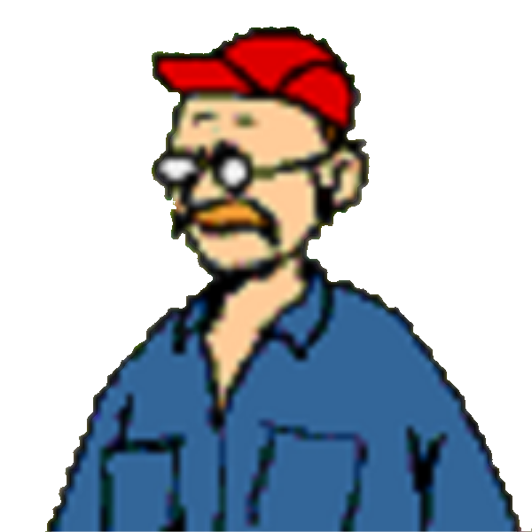
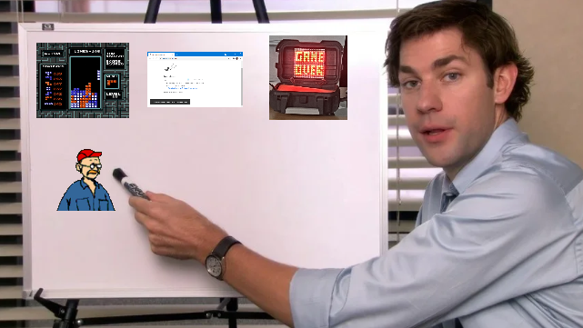
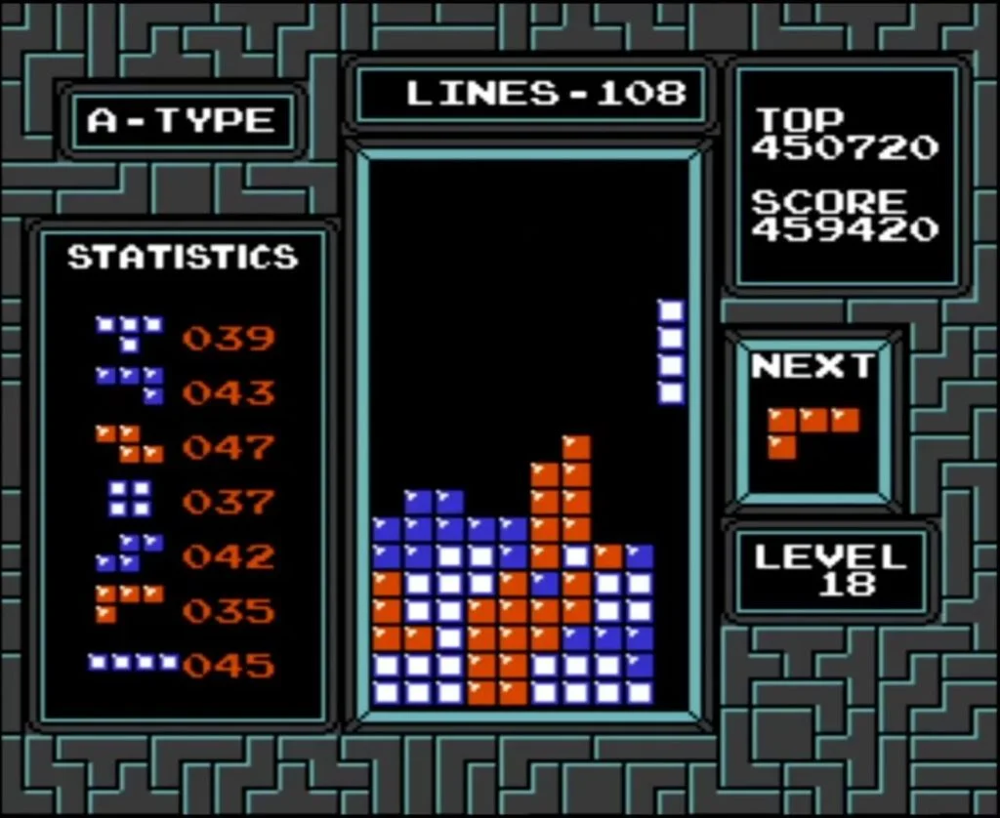
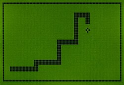
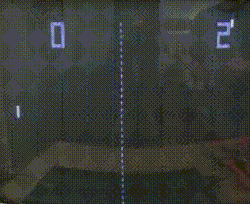
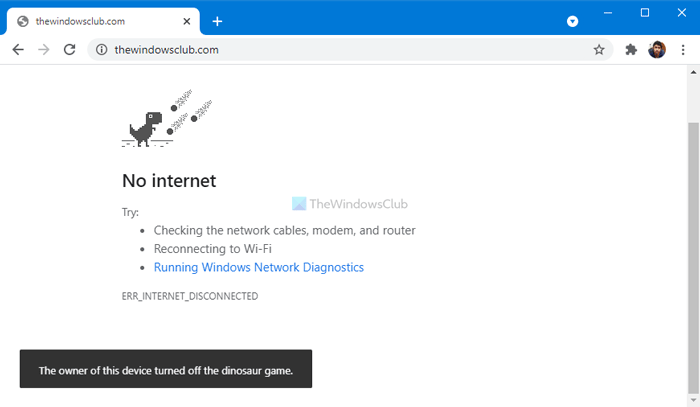
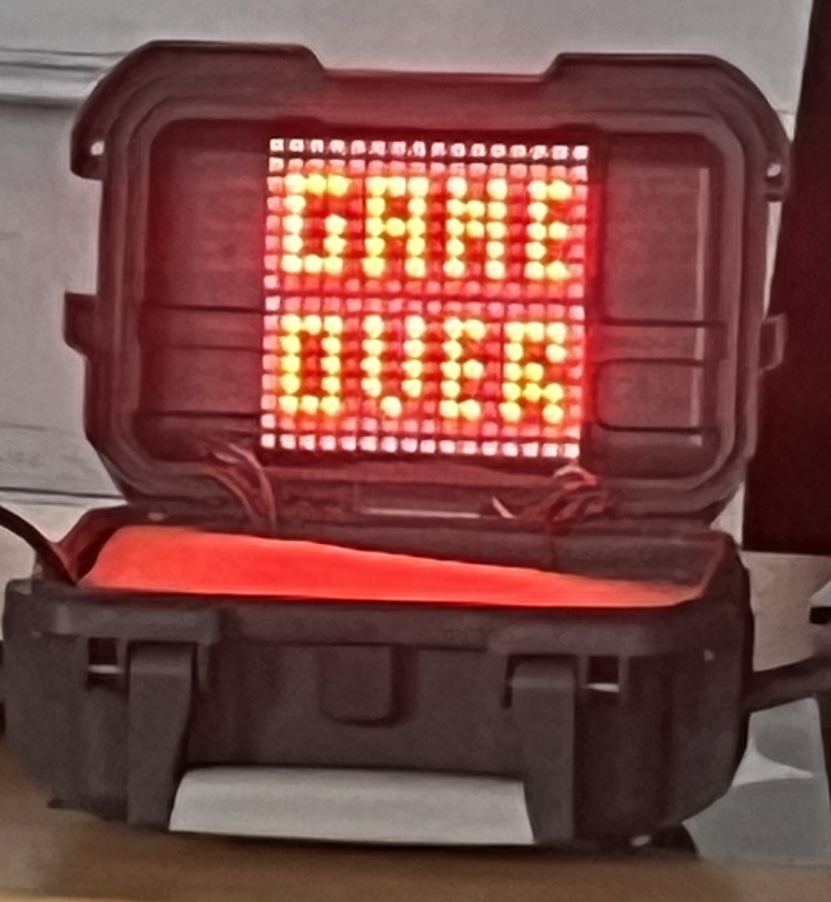
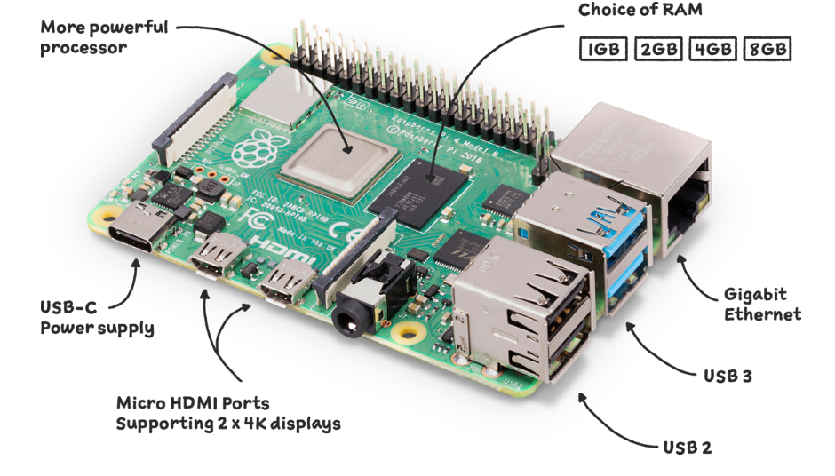
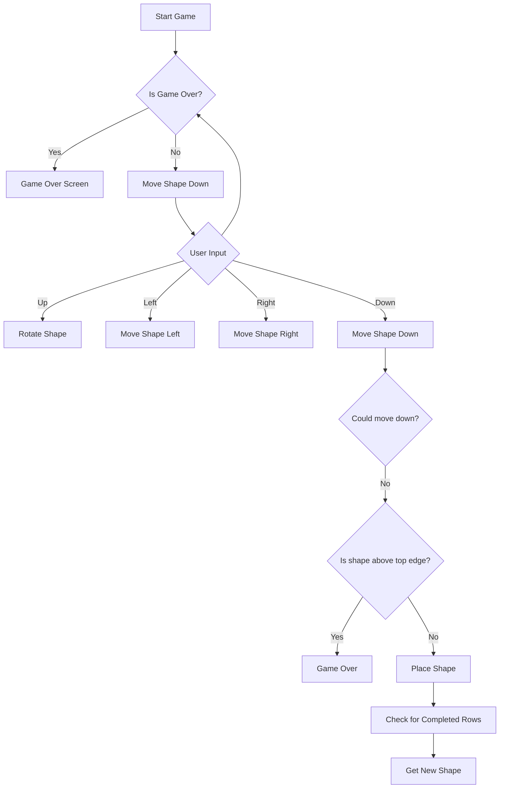

<!--
dark: false

@fieteInfobox: <br><table style="background-color:rgb(115, 115, 105); border: 5px solid rgb(127, 127, 114); margin-left: 0; padding: 8px"><tr><td style="white-space: nowrap; padding-left:24px; text-align: left; font-size: 1.2em; color: #ffffff; vertical-align: middle;">"@0"</td><td style="padding-right: 8px; padding-bottom:0"></td></tr></table>

@H4: <span style="font-size: 2em"><strong>@0</strong></span>

@Tetris: <strong><span style="color:rgb(85, 76, 255);">T</span><span style="color:rgb(255, 0, 0);">E</span><span style="color:rgb(255, 191, 0);">T</span><span style="color:rgb(56, 184, 52);">R</span><span style="color:rgb(20, 180, 244);">I</span><span style="color:rgb(255, 111, 0);">S</span></strong>

script:   https://cdn.jsdelivr.net/npm/mermaid@10.5.0/dist/mermaid.min.js


@onload
mermaid.initialize({ startOnLoad: false });
@end

@mermaid: @mermaid_(@uid,```@0```)

@mermaid_
<script run-once="true" modify="false" style="display:block; background:rgb(148, 172, 191); padding: 24px; border: 2px solid rgb(192,216,230)">
async function draw () {
    const graphDefinition = `@1`;
    const { svg } = await mermaid.render('graphDiv_@0', graphDefinition);
    send.lia("HTML: "+svg);
    send.lia("LIA: stop")
};

draw()
"LIA: wait"
</script>
@end

@mermaid_eval: @mermaid_eval_(@uid)

@mermaid_eval_
<script>
async function draw () {
    const graphDefinition = `@input`;
    const { svg } = await mermaid.render('graphDiv_@0', graphDefinition);
    console.html(svg);
    send.lia("LIA: stop")
};

draw()
"LIA: wait"
</script>
@end
-->

[](https://liascript.github.io/course/?https://raw.githubusercontent.com/Friedy630/Matrix_Games/refs/heads/main/Presentation.md)

# LED Box Project

[](https://github.com/Friedy630/Matrix_Games)

<!--
1. Attention grabber
2. What will audience get out of watching/listening to you? Why should they?
3. What is the scope of your presentation (how much are you loading on to the audience)?
4. What was your inspiration? What were your initial ideas? Was there anything you tried but abandoned?
5. What background information, theory or technical details do your audience need to know to be able to understand your show/game?
6. Code (Product)
-   Big picture
-   Important code snippets
-   Bug examples
-   What did you already know (and from where do you know it) and what did you have to learn to complete the project?
7. Code (process)
-   How did you code? Vibe? GitHub?
8. The show/game. Demo and description
9. Conclusion
10. Reflection. What did we get from taking part in this challenge?
11. Final thought/take-home message
-->

## 1. (Attention Grabber)

<!--
Talk is cheap. Show me the code - Linus Torvalds

Never trust a computer you can't throw out a window - Steve Wozniak

It doesn't (yet?) run Doom.

Picture of Oscilloscope running Pong

!?[Presentation!](https://www.youtube.com/watch?v=H7RkiOck8u4]
-->

nothing yet

## 2. Presentation Objectives

- Present the developed system in a way that makes both the implementation and outcome transparent.

- Show what was built – not just by describing it, but by demonstrating core features and design principles.

- Explain how the project evolved from a single game into a modular framework for LED-based mini-games.

- Outline the technical structure and highlight key challenges and solutions during development.

- Provide insight into what was learned – both technically and conceptually.

<div style="text-align: center">
    
</div>

## 3. Outline / Ideas

We had many ideas:

-   Falling Sand Simulation
-   Presentation Screen
-   3 Body Problem Simulation
-   Slither.io Clone

@fieteInfobox(The final idea was to program <strong><span style="color: #6c63ff;">T</span><span style="color: #f44336;">E</span><span style="color: #ffeb3b;">T</span><span style="color: #4caf50;">R</span><span style="color: #2196f3;">I</span><span style="color: #ff9800;">S</span></strong><br> but that escalated _quickly_)

<br><br>

{{1}}
Tetris was done after one night.

{{2}}
Then we decided to add more games

{{3}}
and we ended up with a whole framework for games...
but more about that later.

## 4. Inspiration / History of Games

### Tetris[^3]

<div style="text-align: center">
    
</div>

-   Developed in 1985 by **Alexey Pajitnov** on an **Elektronika 60** (not an IBM machine)
-   Hardware:
    -   16-bit system
    -   8 KB RAM
-   One of the best-selling video games of all time
-   Considered a video game classic
-   Licensed to **Nintendo** (Game Boy, NES), which gave it massive popularity
-   Now a standalone company: **The Tetris Company**

### Snake[^1][^2]

<div style="text-align: center">
    
</div>

-   Released in 1998 as one of three games on the **Nokia 6110**, developed by **Taneli Armanto**
-   Marketing wanted to offer users more game options
-   Gained huge popularity due to its simplicity and low hardware requirements
-   Early "snake-like" games were two-player games where players competed against each other
-   Early versions didn’t reference a snake but had similar mechanics

### Conway’s Game of Life[^4]

<div style="text-align: center">
    
</div>

-   Created in 1970 by **John Horton Conway**, British mathematician
-   A **cellular automaton** – more a simulation than a game (“zero-player game”)
-   Completely deterministic
-   Demonstrates how complex behavior can evolve from simple rules
-   Some simple shapes: [wikipedia](https://en.wikipedia.org/wiki/Conway%27s_Game_of_Life#:~:text=its%20initial%20configuration.-,Still%20lifes,-Block)
-   Called “Game of Life” because it reflects the idea that our universe is believed to be based on a few fundamental rules

### Pong[^5]

<div style="text-align: center">
    
    
</div>

-   Released in 1972 by **Atari** for arcades
-   First commercially successful video game
-   Developed by **Allan Alcorn** as a training exercise, assigned by **Nolan Bushnell**
-   Bushnell and **Ted Dabney** were impressed by the result and decided to produce it
-   Simulates a simple tennis game

### Chrome Dinosaur Game[^6]

<div style="text-align: center">
    
</div>

-   Built-in browser game in **Google Chrome**, appears when there is no internet connection
-   Developed in 2014 by the **Chrome UX Team**: _Sebastien Gabriel, Alan Bettes, Edward Jung_
-   Pterosaurs were added as obstacles in 2015
-   In 2018:
    -   Easter egg for Chrome’s 10th birthday: birthday cake & hat
    -   Feature added to save high scores
-   Source: [chrome://dino/](chrome://dino/)
-   Error page: [chrome://network-error/-106](chrome://network-error/-106)
-   In 2024: **GenDino** released – AI-generated Dino games based on user prompts (later removed)
-   In 2018, creators reported ~270 million games played per month
-   Game can be disabled (includes hidden Easter egg)

<div style="text-align: center">
    
</div>

<details>
??[Dino Game](https://dinorunner.com/de/)
</details>

[^1]:https://en.wikipedia.org/wiki/Snake_(video_game_genre)
[^2]:https://en.wikipedia.org/wiki/Snake_(1998_video_game)
[^3]:https://en.wikipedia.org/wiki/Tetris
[^4]:https://en.wikipedia.org/wiki/Conway%27s_Game_of_Life
[^5]:https://en.wikipedia.org/wiki/Pong
[^6]:https://en.wikipedia.org/wiki/Dinosaur_Game

## 5. Background Information / Hardware

### LEDs

The LED grid is built from a `16×16 matrix of RGB LEDs`.
Even though 256 pixels is extremely limited by modern standards, the visual results are surprisingly expressive.



@fieteInfobox(Here is a close-up view of the LED matrix showing the game over screen every game of ours uses.)


### Raspberry Pi

We used a Raspberry Pi to run the code on. It simplifies development thanks to its native Python support.

It handles real-time display updates, input polling, and filesystem access – making it a fully standalone embedded system.



> Raspberry Pi used as the system controller.


### Python

Python, one of the easiest to learn programming languages to learn, made rapid development and debugging possible. Despite being slower than C, the trade-off in development speed was worth it.

The codebase is structured into three libraries:

- `graphics_library.py`

- `input_library.py`

- `game_library.py`

and several game implementations.

@fieteInfobox(Two out of three people working on this project had to use Python for the first time. <br> But we managed to create a fully functional game framework in just a few weeks.)


### Router

A small WiFi router inside the LED box creates a local network, enabling remote SSH access to the Raspberry Pi.

This setup allowed us to deploy code without opening the box or attaching peripherals.  


@fieteInfobox(That router does not possess an internet connection. <br> Sometimes people were confused why the internet suddenly stopped working.)


## 6. Codebase

### Overview

Two main parts of the codebase:

-   Libraries: `graphics_library.py`, `input_library.py`, `game_library.py`
-   Game implementations: `tetris.py`, `snake.py`, `pong.py`, etc

@fieteInfobox(Libraries provide common functionality for graphics, <br>input handling, and game logic.)

### `graphics_library.py`

-   Defines global colormap
-   Allows us to set brightness
-   Provides abstract functions for drawing pixels and shapes
-   Gives less efficient but easier functions than the native `display` library

{{0}}

```python
def set_pixel(x: int, y: int, color: tuple)

def get_pixel(x: int, y: int)

def fill(color: tuple, override=True)

def set_shape(shape_matrix: np.ndarray, position: Vec, color: tuple, wrapX: bool = False, wrapY: bool = False)

def get_rotated_shape_matrix(shape_matrix: np.ndarray, isleft: bool)

def check_fit(shape_matrix: np.ndarray, position: Vec, wrapX: bool = False, wrapY: bool = False)

def rotate(shape, isleft: bool)

def show()

def clear(override=True)

def clear_row(row: int, color=colors["background"])

def clear_column(column: int, color=colors["background"])

def draw_image(image, x_offset, y_offset)

def fade(factor: float)
```

<br><br>

    {{1}}

<section>

@H4(Shapes)

Shapes are numpy arrays or matrices that help us render any shapes repeatedly.

```python
np.array(
	[
		[1, 0, 0],
		[1, 1, 1],
		[0, 0, 0],
	]
).T
```

</section>

### `input_library.py`

-   Handles user input and controls
-   Provides a list of booleans for reading button states
-   Allowed us to combine multiple key names into a single input
    -   e.g. `inputs["enter"]` can be triggered by both `enter` and `return`

### `game_library.py`

-   Class which all games inherit from
-   Share the same code for the game loop and input handling.

```python
class Game:
    def __init__(self):
        self.running = True
        self.is_game_over = False
        self.score = 0
        self.spt = 0.1  # seconds per tick
        self.tick = 0  # Game tick counter

    def initialise(self):
        """Initialize the game."""
        gl.clear()
        il.initialise()
        self.running = True
        self.is_game_over = False
        self.score = 0

    def play(self):
        """Start the game loop."""
        while self.running:
            if il.inputs["exit"]:
                self.stop()
            if il.inputs["escape"]:
                self.stop()
            if il.inputs["space"] or il.inputs["enter"]:
                if self.is_game_over:
                    self.initialise()
                    self.is_game_over = False
            if not self.is_game_over:
                self.update()
                self.render()
            il.reset_inputs()
            time.sleep(self.spt)
            self.tick += 1

    def set_difficulty(self, difficulty, default_mult):
        self.spt *= default_mult

    def update(self):
        """Update game state."""
        raise NotImplementedError("Update method must be implemented by subclasses.")

    def render(self):
        """Render the game state."""
        raise NotImplementedError("Render method must be implemented by subclasses.")

    def game_over(self):
        """Handle game over state."""
        self.is_game_over = True
        print(f"Game Over! Your score: {self.score}")
        time.sleep(1)
        for x in range(16):
            for y in range(16):
                gl.set_pixel(x, y, game_over_screen[x, y])
        gl.show()

    def stop(self):
        """Stop the game."""
        self.running = False
```

### The Games

We made several games using the libraries we created. Due to the abstraction provided by the libraries, we could implement them quickly and easily.

But in favor of time I will only show one example here:

{{1}}

<section>
@H4(@Tetris)

This was as we said the first game we implemented, and by now it has had many improvements.

Tetris makes heavy use of the shape functionality of the `graphics_library.py`
It even defines its own shape class:

```python
class TetrisShape:
    def __init__(self, shape_matrix: np.ndarray, weight: int, color: tuple = gl.colors["white"]):
        self.shape_matrix = shape_matrix
        self.weight = weight  # chance to spawn this shape
        self.position = gl.Vec(0, 0)  # position on the game field
        self.color = color  # color of the shape
```

@fieteInfobox(This class helps us generate the shapes with weighted randomness. <br> It is also used as the object for the current falling shape.)

<br><br>

</section>
{{2}}

<section>
@H4(Tetris Update Loop)
<br><br>


</section>
{{3}}

<section>
<br>
```python
def update(self):
        if not self.is_game_over:
            il.inputs["up"] |= il.inputs["w"]
            il.inputs["left"] |= il.inputs["a"]
            il.inputs["down"] |= il.inputs["s"]
            il.inputs["right"] |= il.inputs["d"]
            if self.tick % self.fall_prescale == 0:
                il.inputs["down"] = True
            if il.inputs["left"] != il.inputs["right"]:
                self.current_shape.move_horizontal(il.inputs["left"], self.side_to_side_pass)
            if il.inputs["up"] != il.inputs["space"]:
                self.current_shape.rotate(il.inputs["up"], self.side_to_side_pass)
            if il.inputs["down"] or il.inputs["enter"]:
                if not self.current_shape.move_down(self.side_to_side_pass):
                    if self.current_shape.position.y < 0:
                        self.game_over()
                    else:
                        self.current_shape.paste()
                        self.check_for_full_row()
                        self.get_new_shape()
```

</section>

## 7. Development

### Learning Process

for some this was the:
 - first time using python
 - first time using git collaboratively
 - first time tinkering with markdown/liascript

we found out:
 - learning python is easy, games came together quickly
 - using git is not hard, but unintuitive, especially the merging process
 - refactoring is necessary
 - markdown is very easy, _very handy!_

### Coding Process

initial plan: TETRIS! --> done VERY quick

we added:
 - a new main menu to adjust the speed
 - being able to phase through the walls (optional)
 - more shapes (optional)
 - giving those shapes different chances to spawn (optional)

decided to add more games as it was easy to create new ones
added: 
 - snake
 - game of life
 - pong
 - main menu v3, to switch between games *and* adjust difficulty
 - dino

during development of snake and pong, we decided to create an input and a graphics library, because we dont want too much copied code
--> more maintainable

later made the games instances of classes, to better structure the game exits and game starts
--> now new games can be integrated easily

Leander decided to create a website to control a game together
--> needed for pong
--> possible due to input library

some stats:
 - roughly 1700 lines of code (including the webapp)
 - and additional 1400 lines of matrix/array declarations
 - plus around 160 lines for the emulator
 - 120 git commits

@fieteInfobox(I'm a mechanic. I don't know what lines mean. I measure my projects in bolts.)

### Problems

1. testing the remote controls was not possible on jupyter
	- had to create our own emulator using pygame2.
2. making an intuitive user interface with a 16x16 resolution
   	- difficulty slider uses colors to idicate the difficulty
   	- using brightness changes to set a focus
   	- not using words, it is too big (initially the word _"speed"_ was displayed)
3. git merges
   	- using git is not as intuitive as we thought
   	- we had some progress lost along the way due to bad merges
4. keyboard key names
	- pygame and the remote script work with slightly different names
	- lead to confusion, as the key got registered, but nothing was recieved by the box
5. WIFI access
   	- constantly change between communicating with the box or with the wwww
6. update loops
   	- a screen of black between every renderd frame
   	- caused by the `fill()` function to call `show()` automatically
7. coding
   	- of course we had the typical coding problems of smth. not working
   	- or working when is shouldn't
   	- vs code marks errors, still working fine
8. screen brightness
   	- the screen is very bright
   	- lots of testing

## 8. Demonstration

## 9. Conclusion

What started it all
---
The project began as a simple Tetris implementation — a single game, one goal.

What it became
---
We ended up with a modular system capable of running multiple games, all based on a shared architecture.

What worked well
---
- Fast prototyping thanks to abstraction
- Game logic and rendering separated cleanly
- Framework allowed quick addition of new games

What surprised us
---
We spent more time improving the engine than writing individual games — and it was worth it.

@fieteInfobox(What's still missing: <br>It doesn't run Doom. But it could run a few more things — with time.
)

## 10. Reflection

What we took from this project:
 - it was fun
 - experience with git
 - experience working, expecially coding in a team
 - backend and management are a big part of development
 - good example of a project growning and code being 'alive', puts lectures from computer science into perspective
 - experience with python

What would we do differently next time?
 - manage git better, use it more seriously
 - write a script to automate uploading of scripts; tedious process
 - although we had to refactor a lot, this is normal and projects always grow dynamically
 - due to more experience with python, cleaner codebase

## 11. Outlook

We could have done more, especially with the kind of framework we created.

-   More games
-   More features
-   Better remote control
-   3D graphics
-   ...

@fieteInfobox(Unfortunately it will probably never run )
